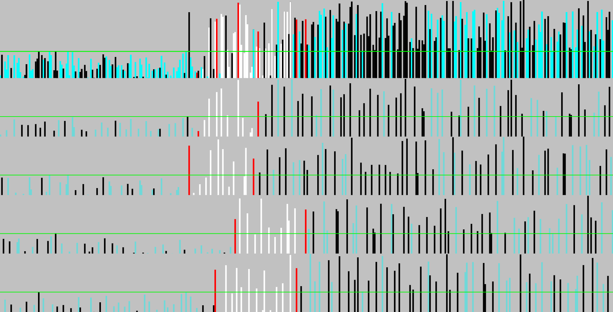

# Parallel-Partition

This repo has the code we used for our experiments. as well as all of the documents we wrote explaining our work (presentations, posters, a writeup).

**Implemented Algorithms**

- **The Recursive Smoothed Striding Algorithm**: a cache-efficient parallel-partition algorithm
- **The Blocked-prefix-sum Partition Algorithm:** an (almost) in-place parallel-partition algorithm with span O(log n log log n)

See how-to-use.txt for more information.

